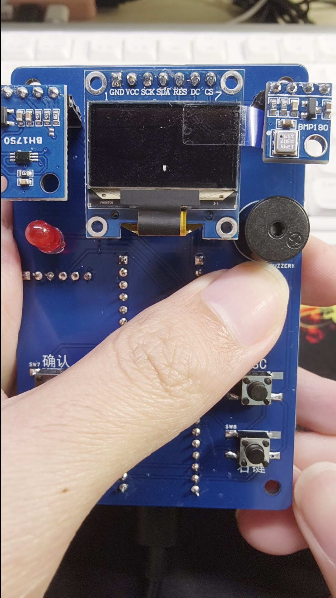
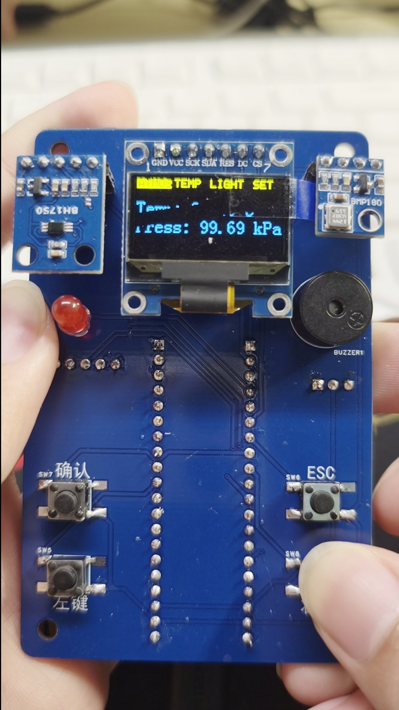
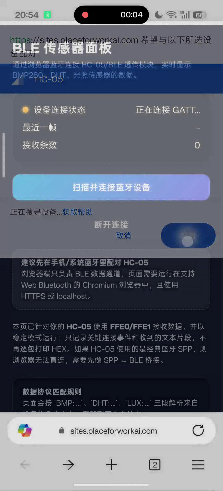
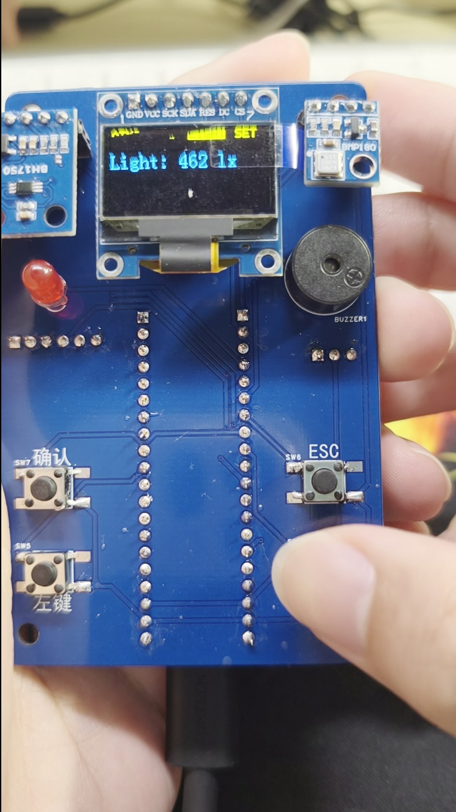

# 环境监测仪


哈尔滨工业大学（深圳）电子工艺实习项目（题号 E1）。**本仓库为该选题下的优秀项目**。手持环境监测仪：MSPM0G3507 采集气压、温湿度、光照，OLED 分页显示，超阈值蜂鸣器/LED 报警，HC-05 把数据透传到浏览器面板。






## 功能

| 模块 | 器件 | 行为 |
| --- | --- | --- |
| 气压/温度 | BMP180 | ATMOS 页；BMP 温度 > 35 °C 报警 |
| 温湿度 | DHT11 | TEMP 页；温度 > 35 °C 或湿度 > 80 % 报警 |
| 光照 | BH1750 / GY-30 | LIGHT 页；< 50 lx 或 > 8000 lx 报警 |
| 显示 | 0.96" SSD1306 | 顶栏 ATMOS / TEMP / LIGHT / SET |
| 按键 | 左 / 右 / 确定 / 返回 | 翻页、进设置、改气压单位与报警方式 |
| 报警 | 蜂鸣器 PWM + LED | SET 页切换蜂鸣器或 LED |
| 无线 | HC-05 UART 9600 | 轮发 `BMP:` / `DHT:` / `LUX:` 文本 |

## 仓库结构

```
firmware/     MSPM0G3507 固件（Keil 主路径）
web/          单页 Web Bluetooth 面板
hardware/     EasyEDA Pro 工程、底板 BOM、外壳 3D 模型
docs/         使用说明、流程图、截图、功能 checklist
assets/       OLED 开机动画源图
```

## 固件

MCU：TI MSPM0G3507（Cortex-M0+，32 MHz，LQFP-64），配合地猛星 M0 底板与自制传感器盾板。

### 引脚

| 功能 | 引脚 |
| --- | --- |
| 软件 I2C SCL / SDA（BMP180 + BH1750） | PA0 / PA1 |
| DHT11 单总线 | PA9 |
| OLED 软件 SPI SCLK / MOSI / RES / DC / CS | PA12 / PA14 / PA21 / PA22 / PA2 |
| HC-05 UART3 TX / RX | PB2 / PB3 |
| HC-05 STATE | PA7 |
| 调试 UART0 TX / RX | PA10 / PA11 |
| 按键 LEFT / RIGHT / ENTER / ESC | PB8 / PB19 / PB20 / PB24 |
| LED | PA31 |
| 蜂鸣器 PWM TIMG0 | PA23 / PA13 |
| SWD | PA20 / PA19 |

### 编译（Keil）

1. 安装 [MSPM0 SDK 1.30.00.03](https://www.ti.com/tool/MSPM0-SDK) 与 Keil MDK + `MSPM0G1X0X_G3X0X` DFP。
2. 系统环境变量 `MSPM0_SDK_INSTALL_DIR` 指向 SDK 根目录。
3. 打开 `firmware/keil/empty_LP_MSPM0G3507_nortos_keil.uvprojx`，Build / Download。
4. 无工具链时可直接烧录 `firmware/prebuilt/env-monitor.hex`。

不要手改 `firmware/ti_msp_dl_config.c` / `.h`。改引脚请编辑 `firmware/empty.syscfg` 后用 SysConfig 重新生成。

GCC / IAR / TIClang 目录是 SDK 空工程模板，**不会**链入 BSP，不能直接编出本项目镜像。

调试串口 UART0，9600 8N1。启动日志：`Board Init [[ ** LCKFB ** ]]`、`SYSTEM = READY`。

更细的构建说明见 [firmware/README.md](firmware/README.md)。

## 网页端

Chrome / Edge，HTTPS 或 `localhost`。先在系统蓝牙里配对名为 `HC-05` 的模块，打开 `web/index.html`，点「扫描并连接」。

固件走经典蓝牙 SPP；浏览器 Web Bluetooth 只能连 BLE GATT。模块必须是 BLE 透传（服务 `FFE0`、通知特征 `FFE1`），或另做 SPP↔BLE 桥。见 [docs/adr/0001-hc05-uart-telemetry.md](docs/adr/0001-hc05-uart-telemetry.md)。

协议与 `firmware/empty.c` 发送格式一致：

```
BMP:
Temp: 25.36 C
Press: 101.32 kPa
DHT:
Temp: 27 C
Humidty: 58 %
LUX:
Light: 123 lx
```

## 硬件

- `hardware/PCB.eprj2`：EasyEDA Pro 工程（传感器盾板）。
- `hardware/BOM-shield.xlsx`：底板焊料（蜂鸣器、按键、LED、排母）。
- `hardware/enclosure/`：外壳 / 底座 / 按键 3mf（Bambu / Prusa 可直接切片）。
- 传感器与蓝牙清单：[docs/parts.md](docs/parts.md)。

## 使用

四键：左、右、确定、返回。左右翻页；任意页按返回回到 ATMOS；设置页确定进入编辑，再按确定改选项。完整说明：[docs/user-manual.md](docs/user-manual.md)（Word 原件 `docs/user-manual.docx`）。

## 文档

- 主循环 / 传感器 / OLED：[docs/diagrams/](docs/diagrams/)
- 功能 checklist：`docs/checklist.xlsx`
- 任务拆解：`docs/work-breakdown.xlsx`
- 领域用语：[CONTEXT.md](CONTEXT.md)

## 许可

应用代码与文档： [MIT](LICENSE)。TI 启动文件与立创板级注释见 [NOTICE](NOTICE)。
